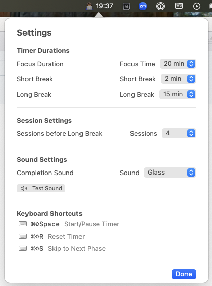
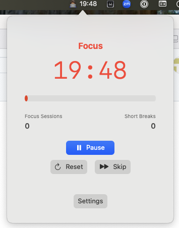

# Pomodoro Timer - macOS Menu Bar App

A Pomodoro timer that runs in your macOS menu bar. Uses the Pomodoro Technique to help manage focus sessions and breaks.

## Features

### Timer Functionality

- **Focus Sessions**: 15-60 minutes (customizable)
- **Short Breaks**: 1-10 minutes between focus sessions
- **Long Breaks**: 10-30 minutes after multiple focus sessions
- **Automatic Transitions**: Moves between focus and break periods
- **Session Tracking**: Counts completed focus sessions and short breaks
- **Daily Reset**: Resets session counters at midnight

### Settings

- Focus duration: 15, 20, 25, 30, 35, 40, 45, 50, 55, 60 minutes
- Short break duration: 1-10 minutes
- Long break duration: 10, 15, 20, 25, 30 minutes
- Sessions before long break: 2-6 sessions
- Choose session completion sound

### Keyboard Shortcuts

- **⌘⇧Space**: Start/Pause timer
- **⌘⇧R**: Reset current timer
- **⌘⇧S**: Skip to next phase

### Interface

- Color-coded phases (Red for focus, Green for short breaks, Blue for long breaks)
- Progress bar showing session completion
- Session counters
- Menu bar integration with live timer display

### Controls

- **Start/Pause Button**: Begin or pause the current timer session
- **Skip Button**: Jump to the next phase without waiting for the timer to complete
- **Reset Button**: Reset the current timer to its full duration
- **Settings**: Customize timer durations and session counts

### Notifications

- Audio notifications when sessions complete
- Choose from 14 different system sounds

## Screenshots

### Settings Window



### Timer Window



## Building the App

### Requirements

- macOS 14.0 or later
- Xcode 15.0 or later

### Build Instructions

1. Open the project in Xcode:

   ```bash
   cd pomodoro
   open PomodoroTimer.xcodeproj
   ```

2. Select your target device (Mac)

3. Build and run (⌘R)

4. The app will appear in your menu bar

### Installation

After building, the app runs from Xcode or can be archived for distribution. The menu bar icon shows the current timer status with emojis (👩🏾‍💻 for focus, ☕ for breaks).

## Usage

### Basic Operation

1. Click the menu bar icon to open the timer interface
2. Click "Start" to begin a focus session
3. Use keyboard shortcuts for quick control:
   - ⌘⇧Space to start/pause
   - ⌘⇧R to reset
   - ⌘⇧S to skip to next phase

### Settings

1. Click the menu bar icon
2. Click "Settings" in the timer interface
3. Adjust durations and session counts as needed
4. Choose your preferred completion sound from the dropdown menu
5. Test the sound using the "Test Sound" button
6. Click "Done" to save changes

### Timer Flow

- **Focus Session** → **Short Break** → **Focus Session** → **Short Break** → ... → **Long Break**
- After completing the set number of focus sessions, you get a long break
- The cycle then repeats
- Session counters reset daily at midnight

## Technical Details

### Architecture

- **SwiftUI**: UI framework
- **AppKit**: macOS integration for menu bar
- **Combine**: State management
- **UserNotifications**: Sound notifications

### Components

- `PomodoroTimerApp.swift`: Main app entry point, menu bar setup, and AppDelegate implementation
- `PomodoroManager.swift`: Timer logic and state management
- `ContentView.swift`: Main UI interface and embedded SettingsView

### File Structure

```
PomodoroTimer/
├── PomodoroTimerApp.swift     # Main app + AppDelegate + menu bar logic
├── PomodoroManager.swift      # Timer logic and state management
├── ContentView.swift          # Main UI + SettingsView (embedded)
└── Assets.xcassets/          # App icons and assets
```

### Menu Bar Integration

The app uses `INFOPLIST_KEY_LSUIElement = YES` in the project configuration to run as a menu bar app without showing in the Dock or App Switcher.

## Development

### Adding Features

The modular design allows easy extension:

- Add new timer phases in `PomodoroPhase` enum
- Extend settings in the embedded `SettingsView`
- Add new keyboard shortcuts in the `AppDelegate` section

### Styling

The app uses SwiftUI's styling system. Colors and fonts can be modified in the respective view files.

## Troubleshooting

### Common Issues

1. **App doesn't appear in menu bar**: Check that `INFOPLIST_KEY_LSUIElement` is set to `YES` in the project settings
2. **Sounds not playing**: Check sound permissions in System Preferences

### Permissions

The app requires:

- Sound permissions for session completion alerts
